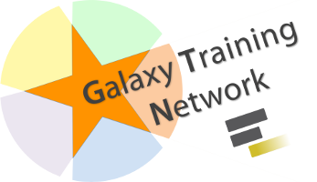

name: inverse
layout: true
class: center, middle, inverse

<div class="my-footer"><span>


</span></div>

---

# Time-Travel Through Your Galaxy

by Art Eschenlauer

25 May 2019

---

### Time-Travel Through Your Galaxy


<br />
<br />
How to use the TARDIS to backup and restore<br />
a docker-compose based Galaxy instance
---

### Administering a Local Galaxy

.left[
Suppose that:
- You want to host a local instance of Galaxy.
- You want to lose nothing if your Galaxy is swallowed by a black hole.
- You want your backups to be efficient, easy to manage, secure, and offsite.

Basically, you want to be able to travel (back) in time.

The Galaxy ["Temporal Archive Remote Distribution and Installation System", https://github.com/HegemanLab/galaxy-tardis](https://github.com/HegemanLab/galaxy-tardis) may be right for you.
]

---

### [Don't Panic](https://en.wikipedia.org/wiki/Phrases_from_The_Hitchhiker%27s_Guide_to_the_Galaxy#Don't_Panic)

.left[
TARDIS simplifies:
- backing up a Galaxy instance
- scheduling backups conveniently
- restoring the Galaxy instance
  - from the latest backup
  - from the most recent backup before a specifed date

TARDIS assumes:
- that Galaxy is running
  on [Usernetes](https://github.com/rootless-containers/usernetes)
  in [docker](https://en.wikipedia.org/wiki/Docker_(software)) (or [docker-compose](https://docs.docker.com/compose/overview/))
- that the Galaxy is backed up to two
  [S3-compatible](https://en.wikipedia.org/wiki/Amazon_S3#S3_API_and_competing_services)
  buckets

It is likely that TARDIS could be adapted to work other docker-based Galaxies that are not running under Usernetes.
]

---

### Getting Started - TL;DR - part 1 - Setup Composition and the TARDIS

**For the impatient**
.left[
- Install Usernetes, then start docker in Usernetes, see e.g.:
  - https://github.com/rootless-containers/usernetes#start-dockerd-only-no-kubernetes
- Next, build the TARDIS:
```bash
git clone https://github.com/HegemanLab/galaxy-tardis.git
cd galaxy-tardis
docker build -t tardis .
cp s3/dest.config.example s3/dest.config
cp s3/dest.s3cfg.example s3/dest.s3cfg
```
- Next customize `dest.config` and `dest.s3cfg`, and then:
```bash
cd galaxy-tardis/restore_example
ln -s dot_env_for_compose .env
cp setup_env.example my_setup_env
```
- Now customize `my_setup_env`
]

---

### Getting Started - TL;DR - part 2 - Restore or Run Galaxy

**Continuing for the impatient**
.left[

To instantiate a fresh Galaxy:
```bash
bash -c "export TLDR_RUN_MODE=fresh;   bash my_setup_env &amp;&amp; bash TLDR"
```

To instantiate restore a Galaxy from an S3-compatible bucket:
```bash
bash -c "export TLDR_RUN_MODE=restore; bash my_setup_env &amp;&amp; bash TLDR"
```

To instantiate run the existing Galaxy:
```bash
bash -c "export TLDR_RUN_MODE=run;     bash my_setup_env &amp;&amp; bash TLDR"
```

To schedule daily backups from a running Galaxy at 6 hours UTC:
```bash
restore_example/compose_cron_backup.sh 06
```
]

---

### Prelude to the Overview of Using the TARDIS

.left[
The next section provides an introduction to the details of how the TARDIS may be used directly.

However, the `restore_example` subdirectory includes some scripts that package and automate invocation of the TARDIS in the context of a general docker-composition of Galaxy, and the `restore_example/TLDR` script demonstrates this.

For now we will dive into the details of what the TARDIS does in response to each subcommand, but after that we will return to `TLDR` and the other scripts in the `restore_example` subdirectory.
]

---

### A Brief Overview of Using the TARDIS - part 1

- Clone the code from [https://github.com/HegemanLab/galaxy-tardis](https://github.com/HegemanLab/galaxy-tardis)
- You need to build and run a Docker image for the TARDIS under Usernetes
    - Hopefully, it will soon be possible to pull the image from a repository.
- The TARDIS uses two S3-compatible buckets for backup and restore:
    - one bucket stores the Galaxy configuration and PostgreSQL database
    - the other bucket stores the datasets (and can be the same as your SWIFT object store)
    - The buckets are configured via `s3/dest.config` and `s3/dest.s3cfg`; see corresponding `.example` files.
- The code includes:
    - a `restore_example/` subdirectory, providing the `compose_*.sh` scripts.
        - These wrap management of the composition, as discussed below.
    - a `restore_example/util/` subdirectory, providing convenience scripts.
    - a `restore_example/setup_env.example` file, which:
        - has variables that can be adapted to your specific needs
        - can be run to generate the files used by the `compose_*.sh` scripts,
          `docker-compose-env.yml`, and `tardis_envar.sh`.
- Source `tardis_envar.sh` to set up the `TARDIS` environment variable to invoke TARDIS.
---

### A Brief Overview of Using the TARDIS - part 2

.left[
The TARDIS was built and tested to run on rootless Docker in Usernetes.
Read and understand the [requirements for Usernetes](https://github.com/rootless-containers/usernetes#requirements);
in a nutshell, Ubuntu just works without special intervention.

**Setting Up Usernetes**

- Get and decompress a Usernetes release from
  [https://github.com/rootless-containers/usernetes/releases](https://github.com/rootless-containers/usernetes/releases)
  and move the result to `~/usernetes` (for example).
- For convenience, to simplify starting the rootless Docker daemon, you may want to invoke
```
sh restore_example/util/usernetes_activate.sh ~/usernetes
```

**Starting the `rootless` Docker Daemon**

- Activate the usernetes path and run the appropriate task
```
pushd ~/usernetes
. bin/activate
./run.sh default-docker-nokube
popd
```
]

---

### Aside: Why run Docker rootlessly?


<br />
.left[
With an unprivileged Docker daemon:
- There is no need to resort to `sudo` or to add the user to the `docker` group.
- Rogue containers cannot use `dockerd` for privilege escalation.
- Each user runs their own Docker daemon, so one user's actions cannot affect another's containers.
- Quotas and CPU priority (i.e., scheduling) can be managed independently for different users.
  - For example, a `test` or `stage` pseudo-user could have lower priority than a `production` pseudo-user.

Usernetes:
- Runs in userspace.
- Provides rootless Docker and Kubernetes.
]

---

### A Brief Overview of Using the TARDIS - part 2

**Building the TARDIS**

- `cd` to the `galaxy-tardis` directory
- `bash build_notar.sh`

**Running the TARDIS**

- Ensure that `tags-for-tardis_envar-to-source.sh` exists
  - either by copying and adapting<br />`tags-for-tardis_envar-to-source.sh.example`
  - or by customizing `restore_example/setup_env.example` and then:
```
pushd restore_example; bash setup_env.example; popd
```
- Set the `TARDIS` environment variable and invoke the TARDIS, e.g.:
```
. tardis_envar.sh
$TARDIS help
```
- By its definition, `TARDIS` runs as a container named `tardis`, so only one instance can run at a time.

---

### TARDIS Command - `help`

.left[
The following slides detail the summary, shown here, that is produced by the `$TARDIS help` command:
<pre style="font-size:11px">
tardis - Temporal Archive Remote Distribution and Installation System for Galaxy-in-Docker

Usage:
  tardis backup                - Back up PostgreSQL database and galaxy-central/config.
  tardis transmit              - Transmit datasets and backup to Amazon-S3-compatible storage.
  tardis cron [hour24UTC]      - Run backup and transmit daily at hour24 UTC.
  tardis restore_files         - Retrieve datasets from S3 (not desirable when using object store).
  tardis retrieve_config       - Retrieve database and config backup (but not datasets) from S3.
  tardis apply_config [date]   - Restore config from backup, whether from S3 or "tardis backup".
  tardis seed_database [date]  - Replace PostgreSQL database with copy from backup.
  tardis purge_empty_tmp_dirs  - Purge empty tmp directories that accumulate with datasets.
  tardis upgrade_database      - Upgrade the PostgreSQL database to match the Galaxy version.
  tardis bash                  - Enter a bash shell.
  tardis upgrade_conda {url_or_path} {md5sum}
                               - Upgrade conda (both arguments required)
where:
  date        - can be relative (e.g., "1 hour ago") or absolute (e.g., any format accepted by the
                  Linux `date` program, see e.g. https://linux.die.net/man/1/date)
  hour24UTC   - any two digit hour for backup to occur; must be UTC (GMT), not local time.
  url_or_path - any URL from https://repo.continuum.io/miniconda/, or path (e.g., if you
                  copied the miniconda installer to your export directory)
  md5sum      - MD5 digest for url_or_path, e.g., from https://repo.continuum.io/miniconda/
</pre>
]

---

### TARDIS Command - `backup`

- Backs up to `/export/backup`:
  - configuration directory (`/export/config/*.xml`)
  - pgadmin directory (`/export/pgadmin`)
  - PostgreSQL data (`*.conf` and a result from `pg_dumpall`)
  - definitions of conda environments (under `/export/tool_deps/_conda/envs`)
- Requires that PostgreSQL be running.
- Required Docker bind-mounts (defined by `tardis_envar.sh`):
  - `/export`
  - `/pgparent`
  - `/var/run/docker.sock`
---

### TARDIS Command - `transmit`

- Transmits to the S3 config bucket
    - the backup configuration data gathered by the `backup` command.
    - the installed tools from the toolshed(s) and
        - the definitions needed to reconstruct the conda environments needed to support the tools
        - but not the actual contents of the environments, which can be fairly large
- Transmits to the S3 dataset bucket any datasets not currently on S3.
- Required Docker bind-mounts (defined by `tardis_envar.sh`):
    - `/export`
    - `/opt/s3/dest.s3cfg`
    - `/opt/s3/dest.config`
---

### TARDIS Command - `cron [hour24UTC]`

- Once a day, run `backup` and (if it succeeds), run `transmit`.
- `hour24UTC`, if supplied, must be a two digit specification of the hour to run.
  - Only values in the range `00-23` are accepted.
  - This is optional, the default is `01`.
  - Specifies hour in UTC (GMT), not local time.
- Requires that PostgreSQL be running.
- Required Docker bind-mounts (defined by `tardis_envar.sh`):
  - `/export`
  - `/pgparent`
  - `/var/run/docker.sock`
  - `/opt/s3/dest.s3cfg`
  - `/opt/s3/dest.config`
---

### TARDIS Command - `restore_files`

- Retrieves datasets from the S3 dataset bucket.
- Required Docker bind-mounts (defined by `tardis_envar.sh`):
  - `/export`
  - `/opt/s3/dest.s3cfg`
  - `/opt/s3/dest.config`
---

### TARDIS Command - `retrieve_config`

- Retrieves from S3 configuration bucket
    - the configuration data originally gathered by the `backup` command.
        - the tools installed from the toolshed(s)
            - the definitions of the conda environments needed to support the tools
- Does *not* retrieve datasets from the other S3 bucket (the `restore_files` command does that).
- Required Docker bind-mounts (defined by `tardis_envar.sh`):
  - `/export`
  - `/opt/s3/dest.s3cfg`
  - `/opt/s3/dest.config`
---

### TARDIS Command - `apply_config [date]`

- Applies configuration data originally gathered by the `backup` command to `/export`.
- Does *not* modify the PostgreSQL database (the `seed database` command does that).
- A date/time pattern may be specified; the most recent backup as of that date will be retored.
  - The pattern is any pattern accepted by [the Linux `date` program](https://linux.die.net/man/1/date).
- Installs the tools and conda dependencies *as of the last backup*, not as of `date`
  - Any tools removed since `date` will have to be reinstalled.
- Required Docker bind-mounts (defined by `tardis_envar.sh`):
  - `/export`
  - `/var/run/docker.sock`

---

### TARDIS Command - `seed_database [date]`

- Restores the PostgreSQL database to its most recent state if no date/time is specified.
- When a date/time pattern is specified; the most recent backup as of `date` will be restored.
  - The pattern is any pattern accepted by [the Linux `date` program](https://linux.die.net/man/1/date).
- Required Docker bind-mounts (defined by `tardis_envar.sh`):
  - `/export`
  - `/var/run/docker.sock`
---


### TARDIS Command - `upgrade_database`

- Upgrades the PostgreSQL database schema to match the version of Galaxy installed.
    - You should backup the database beforehand
        - The Galaxy TARDIS can help with that :)
- Requires that PostgreSQL be running.
- Required Docker bind-mounts, defined by `tardis_envar.sh`:
    - `/var/run/docker.sock`

---

### TARDIS Command - `bash`

- You can run a bash shell within the TARDIS.
  - You can pass arguments to bash as you would pass arguments to `docker run`
  - For example, `docker run -ti --rm tardis bash -c "echo hello world"`
---

### TARDIS Command - `upgrade_conda {url_or_path} {md5sum}`

- To replace the conda base package:
    - Choose an environment from [https://repo.continuum.io/miniconda/](https://repo.continuum.io/miniconda/)
    - Supply the URL for the relase and md5hash when invoking `upgrade_conda`
    - Alternatively, you can copy the release to `/export` and supply the full path in lieu of the URL
- Restoration installs each environment from a manifest rather than copying content from S3.
    - The `upgrade_conda` command allows fresh replacement of the base conda environment with one of your own choosing.
    - Probably a good time to do this is when you are doing a full restoration.
        - The internal structure of conda environments (e.g., paths) is somewhat dependent on the base environment.
        - In the worst case, assuming you have backed up to S3, you can  recreate the environments:
```bash
rm -rf /export/tool_deps/_conda
$TARDIS retrieve_config && $TARDIS apply_config
```

---

### `restore_example` - An Example of a Galaxy backed up by S3

- Our lab's instance of Galaxy is backed up to S3.  This has been extremely helpful to us because:
    - It gives us offsite backup for disaster recovery.
    - We are still causing disasters (with the help of our systems, hardware, and campus power interruptions) because we are new to administering Galaxy.
    - If you haven't restored a system and tested the result, you have no basis for trust in your backup procedure.
        - We have recovered our Galaxy multiple times, albeit by trial and error.
- What we have learned in the process of restoring our Galaxy has been coded into the TARDIS and the scripts in the `restore_example` subdirectory.

---

### Running Disconnected

#### `screen`

baz

#### `systemd --user`


```
# TODO Note that I did `sudo loginctl enable-linger floyd` to keep galaxy session from terminating, per
#      https://www.brendanlong.com/systemd-user-services-are-amazing.html

# TODO add a script to init the docker.service in user directory and daemon-reload
```

---

### Image Credits

- UK Police Box image: [https://pixabay.com/vectors/tardis-doctor-who-time-travel-2311634](https://pixabay.com/vectors/tardis-doctor-who-time-travel-2311634)
- Blue Whale Blowing: [https://pixabay.com/vectors/blue-comic-mammals-ocean-whale-1296931/](https://pixabay.com/vectors/blue-comic-mammals-ocean-whale-1296931/)
- No Anchor Sign: [https://commons.wikimedia.org/wiki/File:NoAnchor.svg](https://commons.wikimedia.org/wiki/File:NoAnchor.svg)
    - Mixed from [https://svgsilh.com/image/156169.html](https://svgsilh.com/image/156169.html) and [https://commons.wikimedia.org/wiki/File:Anchor.svg](https://commons.wikimedia.org/wiki/File:Anchor.svg)

---

## Thank you!

This material is the result of a collaborative work. Thanks to the [Galaxy Training Network](https://wiki.galaxyproject.org/Teach/GTN) and all the contributors!


<div class="contributors-line">


<a href="https://orcid.org/0000-0002-2882-0508" class="contributor-badge">Arthur Eschenlauer</a>


</div>





