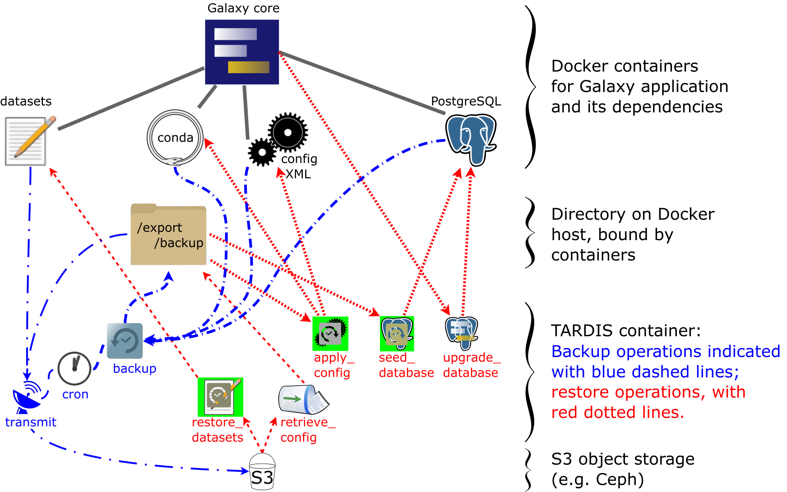
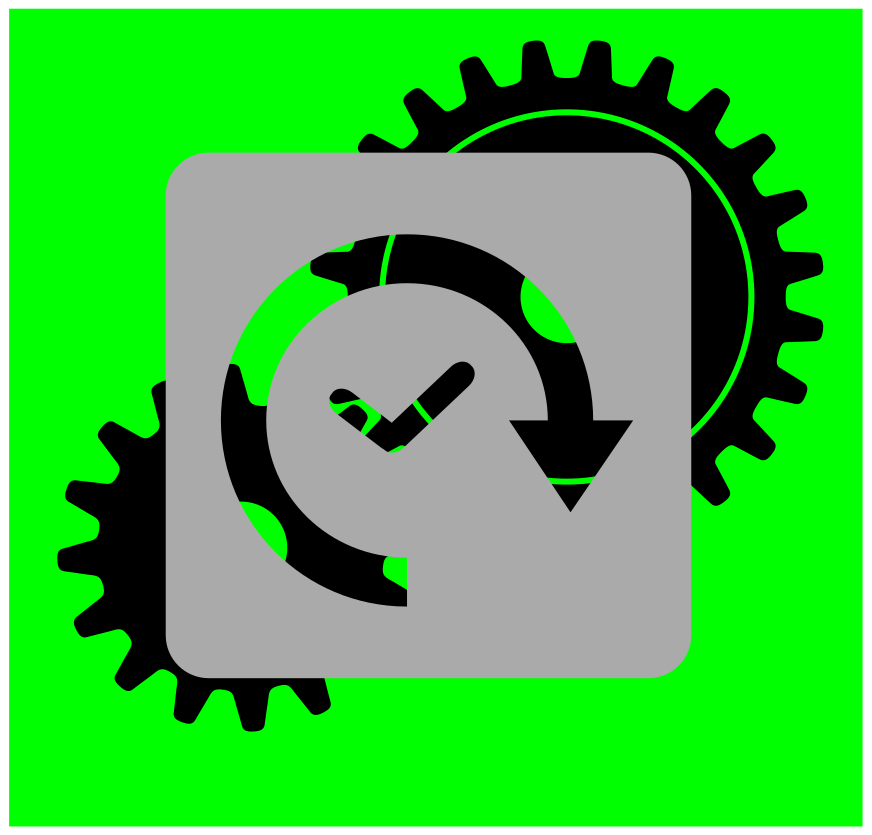
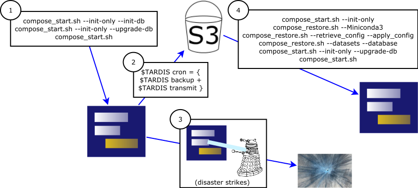

name: frontMatterLayout
layout: true
class: center, middle

<div class="my-footer">
  <span>
    <a href="https://training.galaxyproject.org/">
      
    </a>
  </span>
</div>

---
name: time-travel-through-your-galaxy

# Time-Travel Through Your Galaxy

by Art Eschenlauer

25 May 2019

---
name: time-travel-through-your-galaxy-1

### Time-Travel Through Your Galaxy


<br />
<br />
Using the Galaxy TARDIS to backup and restore<br />
a `docker-galaxy-stable` based Galaxy instance

---
name: table-of-contents
class: left, middle

### Table of Contents

TODO Put here table of contents.

---
name: bodyLayout
layout: true
class: left, middle

<div class="my-footer">
  <span>
    <a href="https://training.galaxyproject.org/">
      
    </a>
  </span>
</div>

---
name: motivation-administering-a-local-galaxy-with-minimal-stress

### Motivation: Administering a Local Galaxy with Minimal Stress

Suppose that:
- You want to host a local instance of Galaxy.
- You want to lose nothing if your Galaxy is swallowed by a black hole.
- You want your backups to be efficient, easy to manage, secure, and offsite.

Basically, you want to be able to travel (back) in time.

The Galaxy ["Temporal Archive Remote Distribution and Installation System", https://github.com/HegemanLab/galaxy-tardis](https://github.com/HegemanLab/galaxy-tardis) may be right for you.
- Any resemblance of the Galaxy TARDIS to [the TARDIS from *Doctor Who*](https://en.wikipedia.org/wiki/TARDIS) is purely (albeit intentionally) coincidental.

Notably, the intent is **not** to replace other automation systems (e.g., ansible):
- Rather, it is focused on restoring a Galaxy instance to a previous state.
- The TARDIS also facilitates migrating a Galaxy instance to another host.

---
name: dont-panic

### [Don't Panic](https://en.wikipedia.org/wiki/Phrases_from_The_Hitchhiker%27s_Guide_to_the_Galaxy#Don't_Panic)

TARDIS simplifies:
- backing up the state of a Galaxy instance
- scheduling backups conveniently
- restoring the Galaxy instance
    - from the latest backup
    - from the most recent backup before a specifed date (i.e., time-travel)

TARDIS assumes:
- that Galaxy is running
  in [Docker](https://en.wikipedia.org/wiki/Docker_(software) (or [docker-compose](https://docs.docker.com/compose/overview/))
- that the Galaxy is backed up to two
  [S3-compatible](https://en.wikipedia.org/wiki/Amazon_S3#S3_API_and_competing_services)
  buckets
    - S3 support is modular; it should be possible to add modules for other storage back-ends.
    - One bucket stores the Galaxy datasets; the other, the Galaxy configuration and database.

---
name: tardis-and-usernetes

### TARDIS and Usernetes

- Our motivation for using Usernetes to run Docker rootlessly and our approach to setting up Usernetes are discussed at length in <br />[Appendix: Running Docker Rootlessly ](#appendix-running-docker-rootlessly) below.
- The TARDIS evolved from scripts running against classic<br /> [`docker-galaxy-stable`](https://github.com/bgruening/docker-galaxy-stable)-based Galaxy installations.
- The TARDIS was developed and tested with "rootless Docker" running on [Usernetes](https://github.com/rootless-containers/usernetes) on Ubuntu 18.04 LTS.
    - It does not directly interact any differently with the Docker daemon than it would with a daemon running as root.
    - Thus, it should work without modification with other Docker-based Galaxies that are not running under Usernetes.
        - Future testing should prove this out.

---
name: prelude-to-the-overview-of-using-the-tardis

### Prelude to the Overview of Using the TARDIS

The next section provides an introduction to the details of how the TARDIS may be used directly.  You likely will build scripts that invoke the commands rather than invoking the scripts directly when using the TARDIS.  

The `restore_example` subdirectory includes some scripts to demonstrate such packaging and automation of TARDIS commands in the context of a general Docker-composition of Galaxy (adapted from those that we use to manage our Galaxy instances). The `restore_example/TLDR` script dispatches these scripts in a sensible order.

We will return to `TLDR` and the other scripts in the `restore_example` subdirectory, but for now, we will dive into the details of what the TARDIS does in response to each subcommand.

---
name: overview-of-using-the-tardis

### Overview of Using the TARDIS

- Clone the code from [https://github.com/HegemanLab/galaxy-tardis](https://github.com/HegemanLab/galaxy-tardis)
- You need to build and run a Docker image for the TARDIS under Usernetes
    - Hopefully, it will soon be possible to pull the image from a repository.
- The TARDIS uses two S3-compatible buckets for backup and restore:
    - one bucket stores the Galaxy configuration and PostgreSQL database
    - the other bucket stores the datasets (and can be the same as your SWIFT object store)
    - The buckets are configured via `s3/dest.config` and `s3/dest.s3cfg`; see corresponding `.example` files.
- The code includes:
    - a `restore_example/` subdirectory, providing the `compose_*.sh` scripts.
        - These wrap management of the composition, as discussed below.
    - a `restore_example/util/` subdirectory, providing convenience scripts.
    - a `restore_example/setup_env.example` file, which:
        - has variables that can be adapted to your specific needs
        - can be run to generate the files used by the `compose_*.sh` scripts,
          `docker-compose-env.yml`, and `tardis_envar.sh`.
- Source `tardis_envar.sh` to set up the `TARDIS` environment variable to invoke TARDIS.

---
name: build-and-fly-the-tardis

### Build and Fly the TARDIS

.tugleft-left[
**Building the TARDIS**
```
cd galaxy-tardis
bash build_notar.sh
```
]
.tugleft-right[

]

**Flying the TARDIS**

- Ensure that `tags-for-tardis_envar-to-source.sh` exists
    - either by copying and adapting<br />
      `tags-for-tardis_envar-to-source.sh.example`
    - or by copying `restore_example/setup_env.example` to `restore_example/setup_env.my_instance`, customizing it, and:<br />
      `pushd restore_example; bash setup_env.my_instance; popd`
        - More information about this option is presented in ["An Example of a Galaxy backed up by S3"](#an-example-of-a-galaxy-backed-up-by-s3)
- Set the `TARDIS` environment variable and invoke the TARDIS, e.g.:<br />
  `tardis_envar.sh`<br />
  `$TARDIS help`
- By its definition, `$TARDIS` runs as a container named `tardis`, so only one instance can run at a time.

---
name: tardis-command---help

### TARDIS Command: `help`

The `$TARDIS help` command produces this summary:

<pre style="font-size:11px">
tardis - Temporal Archive Remote Distribution and Installation System for Galaxy-in-Docker

Usage:
  tardis backup                - Back up PostgreSQL database and galaxy-central/config.
  tardis transmit              - Transmit datasets and backup to Amazon-S3-compatible storage.
  tardis cron [hour24UTC]      - Run backup and transmit daily at hour24 UTC.
  tardis restore_datasets      - Retrieve datasets from S3 (not desirable when using object store).
  tardis retrieve_config       - Retrieve database and config backup (but not datasets) from S3.
  tardis apply_config [date]   - Restore config from backup, whether from S3 or "tardis backup".
  tardis seed_database [date]  - Replace PostgreSQL database with copy from backup.
  tardis purge_empty_tmp_dirs  - Purge empty tmp directories that accumulate with datasets.
  tardis upgrade_database      - Upgrade the PostgreSQL database to match the Galaxy version.
  tardis bash                  - Enter a bash shell.
  tardis upgrade_conda {url_or_path} {md5sum}
                               - Upgrade conda (both arguments required)
where:
  date        - can be relative (e.g., "1 hour ago") or absolute (e.g., any format accepted by the
                  Linux `date` program, see e.g. https://linux.die.net/man/1/date)
  hour24UTC   - any two digit hour for backup to occur; must be UTC (GMT), not local time.
  url_or_path - any URL from https://repo.continuum.io/miniconda/, or path (e.g., if you
                  copied the miniconda installer to your export directory)
  md5sum      - MD5 digest for url_or_path, e.g., from https://repo.continuum.io/miniconda/
</pre>

Each of the other TARDIS commands is described after a visual overview of these operations.

---
name: visual-overview-of-tardis-operations

### Visual Overview of TARDIS Operations



---
name: tardis-command---backup--

### TARDIS Command: `backup` &nbsp;&nbsp;&nbsp; 

The `backup` command:
- backs up the following to `/export/backup`:
    - XML files from the Galaxy configuration directory (`/export/config/*.xml`)
    - The pgadmin directory (`/export/pgadmin`)
    - The PostgreSQL database (`*.conf` and a result from `pg_dumpall`)
    - The definitions of conda environments (under `/export/tool_deps/_conda/envs`)
- Requires that PostgreSQL be running.
- Does **not** transmit data to the S3 buckets (see the `transmit` command)
- Requires these Docker bind-mounts (defined by `tardis_envar.sh`):
    - `/export`
    - `/pgparent`
    - `/var/run/docker.sock`

---
name: tardis-command---transmit--

### TARDIS Command: `transmit` &nbsp;&nbsp;&nbsp; 

The `transmit` command:
- Transmits to the S3 config bucket
    - the backup configuration data gathered by the `backup` command.
    - the installed tools from the toolshed(s) and
        - the definitions needed to reconstruct the conda environments needed to support the tools
        - but not the actual contents of the environments, which can be fairly large
- Transmits to the S3 dataset bucket any datasets not currently on S3.
- Requires these Docker bind-mounts (defined by `tardis_envar.sh`):
    - `/export`
    - `/opt/s3/dest.s3cfg`
    - `/opt/s3/dest.config`

---
name: tardis-command---cron-hour24utc--

### TARDIS Command: `cron [hour24UTC]` &nbsp;&nbsp;&nbsp; 

The `cron` command:
- Runs continuously until interrupted, e.g., by control-C.
- Once a day, at the hour specified, run `backup` and (if it succeeds), run `transmit`.
- `hour24UTC`, if supplied, must be a two digit specification of the hour to run.
  - Only values in the range `00-23` are accepted.
  - This is optional, the default is `01`.
  - Specifies hour in UTC (GMT), not local time.
- Requires that PostgreSQL be running.
- Requires these Docker bind-mounts (defined by `tardis_envar.sh`):
  - `/export`
  - `/pgparent`
  - `/var/run/docker.sock`
  - `/opt/s3/dest.s3cfg`
  - `/opt/s3/dest.config`

---
name: tardis-command---restore_datasets--

### TARDIS Command: `restore_datasets` &nbsp;&nbsp;&nbsp; 

- Retrieves datasets from the S3 dataset bucket.
- Required Docker bind-mounts (defined by `tardis_envar.sh`):
  - `/export`
  - `/opt/s3/dest.s3cfg`
  - `/opt/s3/dest.config`

---
name: tardis-command---retrieve_config--

### TARDIS Command: `retrieve_config` &nbsp;&nbsp;&nbsp; 

- Retrieves from S3 configuration bucket
    - the configuration data originally gathered by the `backup` command.
    - the tools installed from the toolshed(s)
    - the definitions of the conda environments needed to support the tools
- Does *not* retrieve datasets from the other S3 bucket (the `restore_datasets` command does that).
- Required Docker bind-mounts (defined by `tardis_envar.sh`):
  - `/export`
  - `/opt/s3/dest.s3cfg`
  - `/opt/s3/dest.config`

---
name: tardis-command---apply_config-date--

### TARDIS Command: `apply_config [date]` &nbsp;&nbsp;&nbsp; 

- Applies configuration data originally gathered by the `backup` command to `/export`.
- Does *not* modify the PostgreSQL database (the `seed_database` command does that).
- A date/time pattern may be specified; the most recent backup as of that date will be retored.
  - The pattern is any pattern accepted by [the Linux `date` program](https://linux.die.net/man/1/date).
- Installs the tools and conda dependencies *as of the last backup*, not as of `date`
  - Any tools removed since `date` will have to be reinstalled.
- Required Docker bind-mounts (defined by `tardis_envar.sh`):
  - `/export`
  - `/var/run/docker.sock`

---
name: tardis-command---seed_database-date--

### TARDIS Command: `seed_database [date]` &nbsp;&nbsp;&nbsp; 

- Restores the PostgreSQL database to its most recent state if no date/time is specified.
- When a date/time pattern is specified; the most recent backup as of `date` will be restored.
  - The pattern is any pattern accepted by [the Linux `date` program](https://linux.die.net/man/1/date).
- Required Docker bind-mounts (defined by `tardis_envar.sh`):
  - `/export`
  - `/var/run/docker.sock`

---
name: tardis-command---upgrade_database--

### TARDIS Command: `upgrade_database` &nbsp;&nbsp;&nbsp; 

- Upgrades the PostgreSQL database schema to match the version of Galaxy installed.
    - You should backup the database beforehand
        - The Galaxy TARDIS can help with that :)
- Requires that PostgreSQL be running.
- Required Docker bind-mounts, defined by `tardis_envar.sh`:
    - `/var/run/docker.sock`

---
name: tardis-command---bash--

### TARDIS Command: `bash` &nbsp;&nbsp;&nbsp; 

- You can run a bash shell within the TARDIS.
  - You can pass arguments to bash as you would pass arguments to `docker run`
  - For example, <br />`docker run -ti --rm tardis bash -c "echo hello world"`

---
name: tardis-command---upgrade_conda-url_or_path-md5sum--

### TARDIS Command: `upgrade_conda` &nbsp;&nbsp;&nbsp; 

- The `upgrade_conda {url_or_path} {md5sum}` command allows fresh replacement of the base conda environment with one you choose:
    - Choose an environment from [https://repo.continuum.io/miniconda/](https://repo.continuum.io/miniconda/).
    - Supply the URL for the relase and md5hash when invoking `upgrade_conda`.
        - Alternatively, you can copy the release to `/export` and supply the full path in lieu of the URL.
- It is best to run `upgrade_conda` when during a full restoration because:
    - `apply_config` installs each environment from a manifest rather than copying content from S3.
    - The internal structure of conda environments (e.g., paths) is somewhat dependent on the base environment.
    - If upgrading Conda has broken your environments **and you have backed up to S3**, you can recreate the environments with:<br />
      `rm -rf /export/tool_deps/_conda`<br />
      `$TARDIS retrieve_config && $TARDIS apply_config`

---
name: an-example-of-a-galaxy-backed-up-by-s3

### An Example of a Galaxy backed up by S3

The [`restore_example` subdirectory of the GitHub repository](https://github.com/HegemanLab/galaxy-tardis/tree/master/restore_example) demonstrates:
- How to instantiate a Galaxy 19.01 instance on `docker-compose`.
- How to run `cron` to back up the instance once per day to S3 buckets.
- How to restore a Galaxy instance from S3 buckets (and `docker-compose`).
- (For now, this example only runs on Usernetes.)



---
name: restore_example---an-example-of-a-galaxy-backed-up-by-s3

### `restore_example`--An Example of a Galaxy backed up by S3

- Our lab's instance of Galaxy is backed up to S3.  This has been extremely helpful to us because:
    - It gives us offsite backup for disaster recovery.
    - As new Galaxy administrators, we cause disasters (with the help of our systems, hardware, and campus power interruptions).
    - If you haven't restored a system and tested the result, you have no basis for trust in your backup procedure.
        - We have recovered our Galaxy multiple times.
- What we have learned in the process of restoring our Galaxy has been coded into the TARDIS and the scripts in the `restore_example` subdirectory.
- The scripts use config files produced by `setup_env.*` [as described below](#restore_example---configuration-settings).
- These scripts were developed assuming access to Docker through [Usernetes](https://github.com/rootless-containers/usernetes).
    - [Setup of Usernetes](#setting-up-usernetes) is described below.
    - It is likely that the `restore_example` could be adapted to work with other Docker-based Galaxies that are not running under Usernetes.

---
name: restore_examplecompose_startsh---start-galaxy

### `restore_example/compose_start.sh`--start Galaxy

- Starts the entire Galaxy composition or individual services<br />via `docker-compose` and the `docker-compose-env.yml` file.
    - When no options are supplied, starts the entire composition.
    - The following options may be used individually or combined:
        - `--init-db`
            - Initialize PostgreSQL database if needed.
            - Combine this option with `--init-only`
        - `--upgrade-db`
            - Upgrade initialized or existing PostgreSQL database to match Galaxy.
            - Combine this option with `--init-only`
        - `--init-only`
            - Do not run Galaxy after initializing export-directory and perhaps database.
- You can abort this script by pressing control-C or by running the `kill`
    - This script traps the `INT` and  (sent by control-C) and `TERM` (default signal sent by `kill`).
    - In response, it invokes the `compose_stop.sh` script (see below).

---
name: restore_examplecompose_stopsh---stop-galaxy

### `restore_example/compose_stop.sh`--stop Galaxy

- Performs a graceful shutdown of the Galaxy composition from the `docker-compose-env.yml` file:
    - Signals PostgreSQL to shut down.
    - Waits five seconds.
    - Signals `docker-compose` to bring down all of the services.

---
name: restore_examplecompose_restore---restore-galaxy

### `restore_example/compose_restore.sh`--restore Galaxy

This script wraps most of the TARDIS functions as invocation options:
<pre style="font-size:11px">
  --help                   Show this help text
  --datasets               Restore ALL dataset file (not necessary when using Galaxy object store)
  --retrieve_config        Retrieve config data
  --apply_config ['date']  Apply retrieved config data as of specified date
  --database ['date']      Restore PostgreSQL database (lose database changes since specified backup)
     'date' can be used to specify the newest backup can be applied, i.e., exclude backups newer than the date
     'date' can be any format accepted by the Linxx 'date' program (https://linux.die.net/man/1/date),
         which may be relative (e.g., '3 days ago')
         or RFC822  (e.g., '28 Apr 2019 05:20:23 -5')  [where '-5' means five hours behind UTC]
         or pseudo ISO8601 ('2019-04-28 05:20:23 -05:00')  [where '-05:00' means five hours behind UTC].
         It is quite flexible, so go ahead and try something that makes sense to you.
  --db_upgrade             Upgrade PostgreSQL to match installed Galaxy version
  --Miniconda3             Upgrade /export/_conda to the latest Miniconda3 version. (experimental, requires lynx)
  --Miniconda2             Upgrade /export/_conda to the latest Miniconda2 version. (experimental, requires lynx)
     Upgrading to Miniconda2 will pointless once Galaxy has sunseted Python 2.
</pre>

---
name: restore_example---configuration-settings

### `restore_example`--Configuration Settings

Edit these three files to configure `restore_example`:
- `restore_example/tardis/s3/dest.config`
    - This file names the S3 buckets used for backup and restore.
        - Example at `restore_example/tardis/s3/dest.config.example`
    - Note that `restore_example/tardis` just links to `restore_example/..`
- `restore_example/tardis/s3/dest.s3cfg`
    - This file has the configuration for [the s3cmd utility](https://github.com/s3tools/s3cmd#simple-s3cmd-howto).
        - It is in the format recognized and generated by the<br />`s3cmd --configure` command.
        - Example at `restore_example/tardis/s3/dest.s3cfg.example`
- `restore_example/setup_env.my_instance` (named as you like)
    - Copy this from `restore_example/setup_env.example`
    - Adjust the many variables to meet your needs.
    - `restore_example/setup_env.in` is a "helper" called by this script.

Add one more logical link:
```bash
ln -s restore_example/dot_env_for_compose restore_example/.env`
```

---
name: restore_example---configuration-generation

### `restore_example`--Configuration Generation

Now you can generate the configuraton for the `restore_example/compose_*.sh` scripts.

- To instantiate a fresh Galaxy:
```bash
bash -c "export TLDR_RUN_MODE=fresh;   bash setup_env.my_instance"
```
- To instantiate restore a Galaxy from an S3-compatible bucket:
```bash
bash -c "export TLDR_RUN_MODE=restore; bash setup_env.my_instance"
```
- To instantiate run the existing Galaxy:
```bash
bash -c "export TLDR_RUN_MODE=run;     bash setup_env.my_instance"
```
---
name: restore_example---configuration-result

### `restore_example`--Configuration Result

Configuration-generation produces the following files, relative to `restore_example/`:
- `env-for-TLDR`, which is used by the `restore_example/TLDR` script
- `tardis/tags-for-tardis_envar-to-source.sh` and `tardis/s3/dest.config`, which are needed when you source `tardis_envar.sh`
- `tags-for-compose-to-source.sh`, which is needed by `docker-compose-env.yml`, `compose_start.sh`, and `compose_restore.sh`
- `env-for-compose-to-source.sh`, which is needed by `compose_stop.sh`, `compose_start.sh`, and `compose_restore.sh`
- `dot_env_for_compose`, which should be linked by, or copied to, `.env`
- `docker.service`, which will be discussed below.

---
name: restore_example---fresh-galaxy

### `restore_example`--Fresh Galaxy

If you chose `TLDR_RUN_MODE=fresh`, then, when you `bash TLDR`, the following occur:
- Directories are created as specified in config files, if necessary.
- Galaxy is initialized, as is the database:
```bash
    ./compose_start.sh --init-only --init-db
```
- The database is upgraded if necessary:
```bash
    ./compose_start.sh --init-only --upgrade-db
```
- The `/export/config/tool_conf.xml` file is created if it is missing.
- `compose_start.sh` is invoked without options to launch Galaxy.
  - If `screen` is installed, Galaxy will be launched within it.

---
name: restore_example---restore-galaxy

### `restore_example`--Restore Galaxy

If you chose `TLDR_RUN_MODE=restore`, then, when you `bash TLDR`:
- Directories are created as specified in config files, if necessary.
- Galaxy is initialized, as is the database:
```bash
    ./compose_start.sh --init-only --init-db
```
- Assuming that you chose Miniconda3, Galaxy is restored like so:
```bash
    ./compose_restore.sh --retrieve_config --apply_config --datasets \
      --database --Miniconda3
```
- The database is upgraded if necessary:
```bash
    ./compose_start.sh --init-only --upgrade-db
```
- The `/export/config/tool_conf.xml` file is created if it is missing.
- `compose_start.sh` is invoked without options to launch Galaxy.
  - If `screen` is installed, Galaxy will be launched within it.

---
name: restore_example---run-galaxy

### `restore_example`--Run Galaxy

If you chose `TLDR_RUN_MODE=run` (and the Galaxy instance
has already been initialized), then, when you `bash TLDR`:
- `compose_start.sh` is invoked without options to launch Galaxy.
  - If `screen` is installed, Galaxy will be launched within it.

If you are very lucky, the rudimentary error checking for this
case will warn you when you have not yet initialized Galaxy;
don't rely on it. :)

---
name: appendix-configuring--s3cmd

### Appendix: Configuring `s3cmd`

TODO

---
name: appendix-running-docker-rootlessly

### Appendix: Running Docker Rootlessly

**Unprivileged ("rootless") Docker daemon**

.tugleft-right[
  .center[
    <br />
    
    <br />
    &nbsp;&nbsp;&nbsp;&nbsp;
  ]
]
.tugleft-left[
- There is no need to resort to `sudo` or to add the user to the `docker` group.
- Rogue containers cannot use `dockerd` for privilege escalation.
- Each user runs their own Docker daemon, so one user cannot alter another's containers.
- Quotas and CPU priority (i.e., scheduling) can be managed independently for different users.
  - For example, a `test` or `stage` pseudo-user could have lower priority than a `production` pseudo-user.
]

**Usernetes**
- Rootless containers for unprivileged users; `dockerd` does not run as root.
- Provides rootlesskit, Docker, and Kubernetes.
- See [https://github.com/rootless-containers/usernetes](https://github.com/rootless-containers/usernetes)

---
name: setting-up-usernetes--getting-it

### Setting Up Usernetes--Getting It

- Review and meet the requirements at<br />
  [https://github.com/rootless-containers/usernetes#requirements](https://github.com/rootless-containers/usernetes#requirements)
- Fetch and un-bzip2 the (very big) release from<br />
  [https://github.com/rootless-containers/usernetes/releases](https://github.com/rootless-containers/usernetes/releases), e.g.:
```bash
wget -O - https://github.com/rootless-containers/usernetes/releases/download/v20190511.1/SHA256SUM 2>/dev/null
wget https://github.com/rootless-containers/usernetes/releases/download/v20190511.1/usernetes-x86_64.tbz
sha256sum usernetes-x86_64.tbz
# If the sha256 sums don't match, stop here!
bzip2 -d usernetes-x86_64.tbz
tar -xvf usernetes-x86_64.tar
mv usernetes ~/usernetes
rm usernetes-x86_64.tar
```

---
name: setting-up-usernetes---convenience-script

### Setting Up Usernetes--Convenience Script

If you apply this script:
```bash
sh restore_example/util/usernetes_activate.sh ~/usernetes
```
then you can use
```bash
source ~/usernetes/bin/activate
```
to
- put the `~/usernetes/bin` directory on your path
- set the `DOCKER_HOST` environment variable

Reverse this with:
```bash
deactivate
```

---
name: setting-up-usernetes---docker-daemon

### Setting Up Usernetes--Starting Docker-Daemon

**Running `dockerd` one-off:**

You can run the Docker daemon, `dockerd`, one time with:
```bash
pushd ~/usernetes; ./run.sh default-docker-nokube
```

If you `dockerd` to run after you are log off, and `screen` is installed, this will work:
```bash
screen -S my_docker -d -m bash -c "pushd ~/usernetes; ./run.sh default-docker-nokube"
```
and you can kill it off later with
```bash
screen -r my_docker
```
and pressing control-C.

---
name: usernetes---docker-service

### Setting Up Usernetes--Docker Service

In `systemd` based distributions (such as Ubuntu), you can have the per-user Docker daemon run when you log in by:
```bash
cp docker.service ~/.config/systemd/user/docker.service
systemctl --user daemon-reload
systemctl --user enable docker.service
systemctl --user start docker.service
```
To stop `dockerd`
```bash
systemctl --user stop docker.service
```

To keep the daemon running when you logout, you will have to run the following once:
```bash
sudo loginctl enable-linger $(whoami)
```
(Thanks to Brendan Long for pointing this out on [https://www.brendanlong.com/systemd-user-services-are-amazing.html](https://www.brendanlong.com/systemd-user-services-are-amazing.html))

---
name: image-credits

### Image Credits
<table>
<tr><td>
</td><td>UK Police Box: [https://pixabay.com/images/id-2311634](https://pixabay.com/vectors/tardis-doctor-who-time-travel-2311634)
</td></tr>
<tr><td>
</td><td>Backup: [https://pixabay.com/images/id-153008/](https://pixabay.com/vectors/backup-undo-reload-arrow-circle-153008/)
</td></tr>
<tr><td>
</td><td>Transmitter: [https://pixabay.com/images/id-312354](https://pixabay.com/vectors/transmitter-dish-broadcast-transmit-312354/)
</td></tr>
<tr><td>
</td><td>Clock: [https://pixabay.com/images/id-308937](https://pixabay.com/vectors/clock-time-hour-minute-face-hands-308937/)
</td></tr>
<tr><td>
</td><td>Recall from Trash: [https://pixabay.com/images/id-146276](https://pixabay.com/vectors/undelete-undo-bin-trash-garbage-146276/)
</td></tr>
<tr><td>
</td><td>Apply Datasets: A mix of [https://pixabay.com/images/id-153008/](https://pixabay.com/vectors/backup-undo-reload-arrow-circle-153008/) and [https://pixabay.com/images/id-312111/](https://pixabay.com/vectors/paper-pencil-writing-stationery-312111/)
</td></tr>
<tr><td>
</td><td>Apply Config: A mix of [https://pixabay.com/images/id-153008/](https://pixabay.com/vectors/backup-undo-reload-arrow-circle-153008/) and [https://pixabay.com/images/id-467261](https://pixabay.com/vectors/gears-options-settings-silhouette-467261/)
</td></tr>
<tr><td>
</td><td>Seed Database: A mix of [https://pixabay.com/images/id-153008/](https://pixabay.com/vectors/backup-undo-reload-arrow-circle-153008/) and [https://commons.wikimedia.org/wiki/File:Postgresql_elephant.svg](https://commons.wikimedia.org/wiki/File:Postgresql_elephant.svg)
</td></tr>
<tr><td>
</td><td>Upgrade Database: I drew [the Galaxy logo](https://usegalaxy.org/static/images/galaxyIcon_noText.png) over the PostgreSQL logo [https://commons.wikimedia.org/wiki/File:Postgresql_elephant.svg](https://commons.wikimedia.org/wiki/File:Postgresql_elephant.svg)
</td></tr>
</table>
&nbsp;<!-- &nbsp; needed to force table to render in Remark -->

---
name: image-credits-continued

### Image Credits Continued

<table>
<tr><td>
</td><td>Bash logo: [https://github.com/odb/official-bash-logo/tree/master/assets/Logos/Icons/SVG](https://github.com/odb/official-bash-logo/tree/master/assets/Logos/Icons/SVG)
</td></tr>
<tr><td>
</td><td>Hoop snake: [https://en.wikipedia.org/wiki/File:Ouroboros-simple.svg](https://en.wikipedia.org/wiki/File:Ouroboros-simple.svg)
</td></tr>
<tr><td>
</td><td>Blue Whale: [https://pixabay.com/images/id-1296931/](https://pixabay.com/vectors/blue-comic-mammals-ocean-whale-1296931/)
</td></tr>
<tr><td>
</td><td>[https://commons.wikimedia.org/wiki/File:NoAnchor.svg](https://commons.wikimedia.org/wiki/File:NoAnchor.svg),<br />
a mix of [https://svgsilh.com/image/156169.html](https://svgsilh.com/image/156169.html) and<br />
and [https://commons.wikimedia.org/wiki/File:Anchor.svg](https://commons.wikimedia.org/wiki/File:Anchor.svg)
</td></tr>
<tr><td>
</td><td>Dataset: [https://pixabay.com/images/id-312111](https://pixabay.com/vectors/paper-pencil-writing-stationery-312111/)
</td></tr>
<tr><td>
</td><td>S3 Bucket: adapted from<br />[https://commons.wikimedia.org/wiki/File:Bucket_Mech.svg](https://commons.wikimedia.org/wiki/File:Bucket_Mech.svg)
</td></tr>
<tr><td>
</td><td>Dalek by The2ndD:<br />[https://www.deviantart.com/the2ndd/art/Dalek-392408448](https://www.deviantart.com/the2ndd/art/Dalek-392408448)
</td></tr>
<tr><td>
</td><td>Fresh impact crater: [https://commons.wikimedia.org/wiki/File:Fresh_impact_crater_HiRise_2013.jpg](https://commons.wikimedia.org/wiki/File:Fresh_impact_crater_HiRise_2013.jpg)
</td></tr>
&nbsp;<!-- &nbsp; needed to force table to render in Remark -->

---
name: thank-you

## Thank you!

This material is the result of a collaborative work. Thanks to the [Galaxy Training Network](https://wiki.galaxyproject.org/Teach/GTN) and all the contributors!


<div class="contributors-line">


<a href="https://orcid.org/0000-0002-2882-0508" class="contributor-badge">Arthur Eschenlauer</a>


</div>


